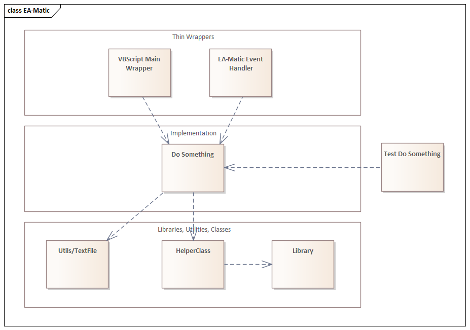

# EA VBScript Guidelines

## Script Design

You want to apply standard software engineering practices to your VB Script design.

### Scope

As VBScript does not have a namespace or module system, everything is in one global scope and your script can access other scripts only through the `!INC` (this appears to be an EA VBScript feature, see "Include Script Libraries" [Script Editor](https://sparxsystems.com/enterprise_architect_user_guide/16.0/add-ins___scripting/script_editors.html))

### Using Classes to provide namespaces

You will need to determine whether your code is a general utility function/procedure that should be in the global namespace, or whether related functions/procedures should be kept together and work on common data and therefore be wrapped in a Class.

By wrapping your code in a Class block it provides another level of namespace to avoid namespace collision in the global namespace.

Suggested naming conventions:

* <Thing>Namespace - namespace for wrapping factory functions, if necessary
* <Thing>Class - the class itself
* <Thing> - exposed as global variable in script, if its a "singleton", or an instance of the namespace for factory function access.

### Layering

If you are going to write more than one script you'll want to ensure you [Don't repeat yourself](https://en.wikipedia.org/wiki/Don%27t_repeat_yourself).

Scripts that are run inside EA should only contain the main procedure and the call of main. The main method should collect the data needed and then invoke methods from the included scripts.

The included scripts should do the actual work.

Common or reusable functions/procedures should be extracted into their own scripts possibly grouping related items.

See Layering diagram:

### option explicit

[option explicit](https://learn.microsoft.com/en-us/previous-versions/windows/internet-explorer/ie-developer/scripting-articles/bw9t3484(v=vs.84)) must appears in a script before any other statements.

Because of this `option explicit` can only be in the top level main scripts, it can not be in any scripts that will be included in another.

## EA Object Model

See [EA Object Model Reference](https://www.sparxsystems.com/enterprise_architect_user_guide/15.2/automation/reference.html) for the details of all objects available in the object model provided by the Automation Interface.

Some key links are listed here:

* [Repository](https://www.sparxsystems.com/enterprise_architect_user_guide/15.2/automation/repository3.html)

* [Diagram](https://www.sparxsystems.com/enterprise_architect_user_guide/15.2/automation/diagram2.html)

* [DiagramObject](https://www.sparxsystems.com/enterprise_architect_user_guide/15.2/automation/diagramobjects.html)

* [Element](https://www.sparxsystems.com/enterprise_architect_user_guide/15.2/automation/element2.html)

## VBScript .NET Classes

You should consider using .NET 4.x+, but beware some of the scripts written in this repository as using .NET 3.5 classes. You either need to install those or rewrite the script to use newer classes.

**NOTE:** Make sure you have the .NET runtimes installed

### Don't use System.Collections.Generics.*

See [Can I use System.Collections.Generic.SortedList in VBscript?](https://stackoverflow.com/questions/71327911/can-i-use-system-collections-generic-sortedlist-in-vbscript)

Use the types from `System.Collections` instead.

Contructors that require parameters can't be used via `CreateObject`

### System.Collections.ArrayList

[ArrayList](https://learn.microsoft.com/en-us/dotnet/api/system.collections.arraylist?view=netframework-4.7.2)

Use instead of VBScript Array as its more full featured

### System.Collections.Hashtable

[Hashtable](https://learn.microsoft.com/en-us/dotnet/api/system.collections.hashtable?view=netframework-4.7.2)

**Remember** key order is unsorted.

### Scripting.Dictionary (Dot NET 3.5)

Avoid Scripting.Dictionary, use Hashtable instead.

